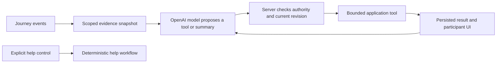

# AI scope, award fit, and authority proposal

Reviewed September 20, 2026. Status: **proposed design, not an enabled live-model release**. This review changes documentation only. The application remains in offline mock mode; no paid model call or external notification was enabled. Current implementation details remain in [AGENT_HARNESS.md](AGENT_HARNESS.md).

## Purpose and award fit

AI should help people keep a journey accompanied: clarify uncertain messages, preserve relevant context, request human coverage, and prepare a useful handoff. The community remains centered on voluntary human participation. AI does not earn recognition or certify character.

The [official HTN prize description](https://hackthenorth2026.devpost.com/#prizes) requires Rox entrants to use an LLM on messy information and take useful actions. OpenAI evaluates API-powered product behavior and a concrete Codex development contribution. Current mock execution establishes neither live requirement. The published descriptions do not require a Rox integration, multiple agents, or MCP. This is our fit assessment, not an eligibility decision.

Rox's engineering guidance favors restricted data interfaces and repeatable snapshots. We can apply this to one journey's evidence and replay tests; a knowledge graph is unnecessary for the initial scope. See [Rox's controlled data interface](https://www.rox.com/articles/why-revenue-agents-are-uniquely-hard-to-build). Its [agent architecture article](https://www.rox.com/articles/how-we-build-agents-at-rox) also emphasizes correct data scope, typed actions, and simpler orchestration. These are engineering references, not additional competition rules.

## Existing foundation and specific gaps

The current implementation has five validated tools, durable runs, action receipts, context revision checks, bounded retries, and participant-only traces. `worker/src/agent.ts` defines the protocol; `worker/src/trips.ts` executes it. Both the harness and the older assessment entry point use deterministic rules, even when an API key exists. The 29 recorded offline agent tests establish application behavior, not LLM comprehension or live-model quality.

Before introducing a live provider:

- Separate escalation authority from inferred concern. Ordinary message keywords currently set urgent status and can queue a contact notification. Repeated missed responses also have a notification policy. Neither should silently become an unrestricted model permission.
- Add an explicit live-AI data notice and choice. Omitting structured identity fields does not remove personal information someone types into chat.
- Replace the mock-specific three-second decision deadline and ten-second lease assumptions with abortable model calls, durable ownership, token budgets, and late-result rejection.
- Bind factual delivery and assignment claims to server receipts. A length-limited message or summary can still contain an invented claim.
- Preserve unresolved concerns beyond a short recent-message window without preserving unnecessary full transcripts. A summary must retain source references and distinguish missing evidence from resolved evidence.

External notifications are currently disabled. These are prerequisites for future activation, not claims that a live model is already contacting anyone.

## Proposed first release

Use one journey-scoped assistant with a small tool set. A participant may explicitly request a summary while a human is active. Autonomous follow-up begins only when the server's declared coverage policy permits it. A missed check-in means contact is overdue; it does not establish that the guardian is asleep or the rider is unsafe.

| Capability | Useful result | Boundary |
| --- | --- | --- |
| Understand the rider's current concern | Ask one relevant clarification and retain unresolved concerns | Do not diagnose danger from stale location or ambiguous wording |
| Reconcile journey evidence | Identify old reassurance, newer concern, conflicting statements, and missing information | Do not invent route telemetry or silently discard conflicts |
| Request human coverage | Persist a recruitment request and show its actual status | No automatic guardian selection, approval, private access grant, or promised response time |
| Prepare a handoff | Give the approved next guardian a brief with sources, times, unresolved issues, and completed actions | Candidates do not receive private summaries; former guardians lose access |
| Follow up within limits | Send an attributed question and schedule an allowed follow-up | No replacement for the rider's own check-in; no unlimited reminders or spending |
| Explain action status | Render queued, provider-accepted, failed, and acknowledged results | No invented notification success or claim that help is on the way |

Human guarding and normal help controls must remain usable when live AI is declined, unavailable, or out of budget. Once a human takes over, the server cancels autonomous pending work and rejects late model actions against the previous revision.

## Evidence and execution design

The proposed execution path is:

Cloudflare remains the owner of permissions, timers, consent, run state, and effects. The model receives no session bearer token, administrator key, issuer key, sponsor key, database connection, or general HTTP/shell capability. Journey identity is injected by the executor rather than chosen in tool arguments. Existing tools remain the starting point: `get_journey_context`, `send_check_in`, `schedule_follow_up`, `request_human_relay`, and a separately gated `notify_trusted_contact`.

An evidence item should identify its source, actor role, event ID, observed and received times, and freshness. Server state establishes assignment, consent, and delivery status. A participant message remains that participant's claim. All journey messages, including system-looking text inside chat, are data rather than developer instructions. Unknown timestamps and unavailable location remain explicit unknowns.

Use the Responses API with narrowly defined function calls and explicit strict schemas. The application validates and executes a proposal, then returns the actual result. Schema conformance is only a format guarantee; it does not establish authorization or factual correctness. See [OpenAI function calling](https://developers.openai.com/api/docs/guides/function-calling). Apply layered input isolation, authorization, and evaluation as described in [OpenAI agent safety guidance](https://developers.openai.com/api/docs/guides/agent-builder-safety).

Participant-facing evidence should show facts with source references, uncertainties, completed actions, and pending actions. Store concise decision explanations and tool receipts, not hidden chain-of-thought. Claims such as successful delivery should be rendered from server enums rather than accepted from model prose. Validate summary references against the supplied snapshot; linked sources still require factual evaluation.

## Authority and escalation

Use separate escalation causes, rather than treating a shared `urgent` flag as permission:

| Cause | Proposed handling |
| --- | --- |
| `explicit_help` | Run the help workflow immediately without waiting for a model; preserve active requests |
| `user_authorized_timeout_policy` | Apply the rider's specific pre-agreed timeout/contact policy in server code |
| `model_concern` | Ask a relevant question, surface help controls, and request permitted human coverage; it does not itself authorize disclosure or external contact |

External contact requires the configured trusted recipient and valid, scoped user authorization, checked again immediately before sending. The rider may give that authorization for defined conditions in advance or confirm the specific action. No arbitrary model-selected recipient or URL is accepted. A provider accepting a request is not proof of receipt or rescue. The first live-model release should keep external delivery disabled until this distinction is implemented and tested.

AI cannot confirm arrival, close a journey on someone's behalf, cancel an explicit help request, appoint a guardian, grant private access, impersonate a rider, or sign a chain transaction. It cannot award contributions, issue appreciation, withdraw recognition, rank character, or claim to be emergency dispatch. It cannot penalize a guardian because it inferred inattention. Recovery from urgent state follows an explicit product policy, not an arbitrary reassuring model response.

Community publication remains separate. Existing authorized server events may record that an automated relay was requested, with system provenance. Model opinions, concerns, conversations, and precise location never become public recognition evidence. All AI interpretation and handoff data remain private to authorized current participants and follow the existing deletion policy.

## Data and resilience

For the initial model input, send only a bounded, relevant slice of the current journey. Exclude account identifiers, contact addresses, wallet information, shared Uber URLs, and exact coordinates from structured fields. Minimize and redact identifiable content in free text before transmission; do not describe this as guaranteed anonymity. Explain the provider transfer and retention configuration before activation. The present community publication notice does not substitute for an AI processing choice.

Cap model turns, input/output tokens, tool attempts, reminders, and spending per run and per journey. Treat a budget exhaustion, refusal, malformed result, timeout, or provider error as an explicit degraded state with human controls still available. No attempt should loop indefinitely. Refresh stale evidence before writes, use stable action IDs to deduplicate effects, and discard late results after handoff, consent revocation, or closure. Keep model/request IDs and versioned prompts in private operational records with bounded retention and no credentials.

## Evaluation and demonstration

Freeze journey snapshots and run the mock and future live adapter against the same tool interface. Begin with a labeled scenario set and hold back variants from prompt tuning. Include negations, typos, conflicting accounts, late and duplicate events, stale location, removed participants, consent revocation, malicious instructions, unavailable providers, and handoff during an outstanding model request. Measure source-grounded summaries, useful clarification, valid tool selection, duplicate effects, false success claims, latency, and token usage. Compare against the rule baseline; do not publish invented benchmark scores.

Critical release checks include zero unauthorized cross-journey access, no model access to signing keys or direct transaction execution, no model-awarded or model-withdrawn recognition, and no bypass of contact authorization in the evaluated cases. Authorized system events may still be published by the existing issuer/sponsor workflow. Passing a finite test set is not a real-world safety certification. Explicit help must work with the model disconnected.

The primary demonstration should create actual application events: a guardian misses a check-in; earlier reassurance conflicts with a newer rider concern; location is unavailable or stale. The model reads the current evidence, asks a useful question, and requests a permitted human relay. The rider approves a volunteer who receives an attributed handoff. Show actual action receipts and that AI follow-up stops after the human returns.

A second demonstration introduces a provider timeout or failed notification and verifies honest status plus uninterrupted human controls. Synthetic or perturbed data must be labeled as such; real application events are not proof of a real emergency. Obtain permission before using any real person's messages or journey information. Sponsor-specific acceptance of a dataset remains a judging decision.

For the OpenAI development story, preserve one concrete Codex example: the separate withdrawal receipt that avoids consuming ordinary event sequence numbers, its regression tests, and verified deployment evidence. Also preserve actual model and tool traces after live integration; development assistance alone is not evidence of application API execution.

## Implementation order

1. Finalize the authority policy, distinguish escalation causes, and add the AI data choice.
2. Define the evidence/summary schema, receipt-based UI claims, and held-out evaluations while staying offline.
3. Add a disabled-by-default OpenAI adapter with durable execution, abort handling, and budgets.
4. After credits and explicit activation are available, run bounded real-model evaluations and a complete application workflow. Keep mock and live evidence separately labeled.
5. Consider voice, additional retrieval, or external contact only after the core handoff workflow and authority checks are demonstrated.

No new blockchain program is required for this proposed scope. The live model must use the existing application permissions rather than acquiring authority over community recognition.
