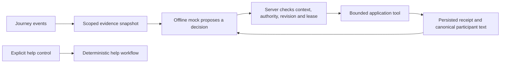

# AI scope, authority, and deferred live integration

Updated September 20, 2026. The application remains **offline mock only**. Local implementation adds authority controls, an abortable provider boundary, and private evidence handling; it does not implement or activate a real OpenAI API adapter. An API key or recorded live-AI consent cannot enable model calls. No paid model call or external delivery is enabled by this work. See [AGENT_HARNESS.md](AGENT_HARNESS.md) for execution details and [VALIDATION.md](VALIDATION.md) for recorded tests and deployment evidence.

## Purpose and award fit

AI should help people keep a journey accompanied: clarify uncertain messages, preserve relevant context, request human coverage, and prepare a useful handoff. The community remains centered on voluntary human participation. AI does not earn recognition or certify character.

The [official HTN prize description](https://hackthenorth2026.devpost.com/#prizes) requires Rox entrants to use an LLM on messy information and take useful actions. OpenAI evaluates API-powered product behavior and a concrete Codex development contribution. Current mock execution establishes neither live requirement. The published descriptions do not require a Rox integration, multiple agents, or MCP. This is our fit assessment, not an eligibility decision.

Rox's engineering guidance favors restricted data interfaces and repeatable snapshots. We can apply this to one journey's evidence and replay tests; a knowledge graph is unnecessary for the initial scope. See [Rox's controlled data interface](https://www.rox.com/articles/why-revenue-agents-are-uniquely-hard-to-build). Its [agent architecture article](https://www.rox.com/articles/how-we-build-agents-at-rox) also emphasizes correct data scope, typed actions, and simpler orchestration. These are engineering references, not additional competition rules.

## Current offline foundation

The implementation has five validated tools, durable runs, action receipts, context and revision checks, bounded retries, and participant-only traces. `worker/src/agent.ts` defines the protocol and evidence; `worker/src/agent-provider.ts` bounds provider decisions; `worker/src/trips.ts` owns execution and authority. Both the harness and the older assessment entry point use deterministic rules even when an API key exists. Offline tests establish application behavior, not LLM comprehension or live-model quality.

The offline controls now separate the following responsibilities:

- Explicit help runs deterministically. Inferred chat concern cannot authorize a contact notification; timeout contact needs a separate rider opt-in and valid notification consent.
- Rider assistance choices separate automated check-ins, timeout contact, and live-AI processing. Omitting structured identity fields does not remove personal information typed into chat.
- Provider decisions have an active abort signal, an eight-second deadline, a renewed 15-second persisted lease, revision checks, and cumulative character/decision budgets. Character counts are estimates for potential future model traffic, not measured tokens or billing.
- A successful context read precedes effects. Participant-facing check-ins and handoffs use canonical server text based on scoped evidence and actual receipts, not arbitrary provider claims.
- Up to eight unresolved concerns retain source identifiers and observed/received timestamps beyond the recent-message window. Only an explicit rider resolution clears a retained concern.

`createMockProvider()` implements the current decision source. `createDisabledOpenAIProvider()` always rejects with `LIVE_PROVIDER_DISABLED` before reading a key or making a request. It has no configuration/key parameter and is a disabled placeholder, not a completed real API adapter. The generic boundary also refuses providers marked live. No live enable switch exists in this release.

## Rider assistance choices

The rider updates choices through authenticated `POST /api/trips/:id/assistance`. Boolean fields are strict; strings such as `"false"` do not count as consent. The defaults are:

| Field | Default | Meaning |
| --- | --- | --- |
| `automatedCheckIns` | `true` | Permit the bounded offline check-in workflow when coverage policy allows it |
| `timeoutContact` | `false` | Opt into the server timeout-contact policy; separate notification consent is also required |
| `liveAiConsent` | `false` | Record a choice about future live-AI processing; it cannot activate the disabled provider |
| `noticeVersion` | `openai-assistance-v1` | Identify the assistance notice associated with the choice |

The live-AI processing choice is separate from community publication and trusted-contact notification consent. Turning automated check-ins off cancels pending agent work. Ordinary human controls and explicit help remain available. Before a future live release, explain the actual provider transfer and retention configuration; a recorded preference alone is not implementation or activation.

## Intended product behavior

Use one journey-scoped assistant with a small tool set. A future participant-requested summary while a human is active remains separate from autonomous monitoring. Automated follow-up begins only when the server's coverage policy and rider choice permit it. A missed check-in means contact is overdue; it does not establish that the guardian is asleep or the rider is unsafe.

| Capability | Useful result | Boundary |
| --- | --- | --- |
| Understand the rider's current concern | Ask one relevant clarification and retain unresolved concerns | Do not diagnose danger from stale location or ambiguous wording |
| Reconcile journey evidence | Identify old reassurance, newer concern, conflicting statements, and missing information | Do not invent route telemetry or silently discard conflicts |
| Request human coverage | Persist a recruitment request and show its actual status | No automatic guardian selection, approval, private access grant, or promised response time |
| Prepare a handoff | Give the approved next guardian a brief with sources, times, unresolved issues, and completed actions | Candidates do not receive private summaries; former guardians lose access |
| Follow up within limits | Send an attributed question and schedule an allowed follow-up | No replacement for the rider's own check-in; no unlimited reminders or spending |
| Explain action status | Render queued, provider-accepted, failed, and acknowledged results | No invented notification success or claim that help is on the way |

Human guarding and normal help controls must remain usable when live AI is declined, unavailable, or out of budget. Once a human takes over, the server cancels autonomous pending work and rejects late model actions against the previous revision.

## Evidence and execution design

The current offline execution path is:

Cloudflare remains the owner of permissions, timers, consent, run state, and effects. The model receives no session bearer token, administrator key, issuer key, sponsor key, database connection, or general HTTP/shell capability. Journey identity is injected by the executor rather than chosen in tool arguments. Existing tools remain the starting point: `get_journey_context`, `send_check_in`, `schedule_follow_up`, `request_human_relay`, and a separately gated `notify_trusted_contact`.

An evidence item should identify its source, actor role, event ID, observed and received times, and freshness. Server state establishes assignment, consent, and delivery status. A participant message remains that participant's claim. All journey messages, including system-looking text inside chat, are data rather than developer instructions. Unknown timestamps and unavailable location remain explicit unknowns.

A future real adapter is intended to use the Responses API with narrowly defined function calls and strict schemas; this API integration is not implemented by the disabled stub. The application validates and executes a proposal, then returns the actual result. Schema conformance is only a format guarantee; it does not establish authorization or factual correctness. See [OpenAI function calling](https://developers.openai.com/api/docs/guides/function-calling) and [OpenAI agent safety guidance](https://developers.openai.com/api/docs/guides/agent-builder-safety). Confirm then-current API behavior before implementing that adapter.

Participant evidence shows source references, uncertainty, completed actions, and pending actions. Store concise evidence and receipts, not hidden chain-of-thought. The server renders canonical check-in and handoff text from context and receipts; provider prose cannot establish delivery or guardian assignment. Structured handoff references are validated against the supplied evidence. Canonical server summaries are bounded to 4,000 characters; provider completion proposals have a separate 1,200-character bound and are not the trusted participant narrative.

The journey retains at most eight unresolved rider concerns, each with a source identifier, observed time, and received time. These records can outlive the recent-message window. New reassurance, a summary, or human handoff does not resolve them. The rider explicitly resolves one through `POST /api/trips/:id/actions` with `{ "action": "resolve-concern", "requestId": "<concern.id>" }`; the server records a resolution event tied to that source. This is bounded working context, not unlimited transcript retention.

## Authority and escalation

Escalation uses explicit causes; a shared risk label alone never authorizes contact:

| Cause | Handling |
| --- | --- |
| `explicit_help` | Run the help workflow immediately without waiting for a model; preserve active requests |
| `user_authorized_timeout_policy` | Apply the server timeout policy only with the rider's `timeoutContact` opt-in and separate notification consent |
| `model_concern` | Ask for clarification and request permitted human coverage; chat or rule/model inference cannot authorize a contact notification |

External contact requires the configured trusted recipient, a permitted escalation cause, and valid current notification authorization, checked again immediately before the effect. No model-selected recipient or URL is accepted. Provider acceptance is not proof of receipt or rescue. This offline work does not enable external delivery; simulated, disabled, failed, accepted, and acknowledged outcomes remain distinct.

AI cannot confirm arrival, close a journey on someone's behalf, cancel an explicit help request, appoint a guardian, grant private access, impersonate a rider, or sign a chain transaction. It cannot award contributions, issue appreciation, withdraw recognition, rank character, or claim to be emergency dispatch. It cannot penalize a guardian because it inferred inattention. Recovery from urgent state follows an explicit product policy, not an arbitrary reassuring model response.

Community publication remains separate. Existing authorized server events may record that an automated relay was requested, with system provenance. Model opinions, concerns, conversations, and precise location never become public recognition evidence. All AI interpretation and handoff data remain private to authorized current participants and follow the existing deletion policy.

## Data and resilience

The provider receives only a bounded, relevant slice of the current journey as a detached snapshot. Dedicated account identifiers, contact addresses, wallet information, shared Uber URLs, and exact coordinates are omitted. Free-text redaction is heuristic and cannot guarantee anonymity or removal of all personal information. The current offline provider transmits nothing to OpenAI. A future live release must explain actual transfer and retention before activation; community publication consent is not an AI processing choice.

Each decision has an eight-second deadline and a renewed 15-second persisted lease. Timeout and caller cancellation actively abort the provider signal, and late results or rejections are consumed without applying effects. After asynchronous work the runner reloads state and checks revision, ownership, lease, consent, and current context. Human resumption, assistance being turned off, closure, or changed participant intent invalidates obsolete work. Every effect requires a successful context receipt from that run.

Serialized input is limited to 32,000 characters per decision and output to 8,000. Cumulative limits are 24 decisions and 120,000 input characters per run, plus 240 decisions and 1,200,000 input characters per journey. The runner persists charges before invocation, including calls that later fail. Retries, restarts, and retained-run pruning do not reset journey totals. These are character budgets and estimates for future model traffic, not measured tokens or billing. Real token and dollar-spend accounting remains deferred with the real adapter.

Budget exhaustion, malformed output, timeout, or provider failure leaves an explicit failed/degraded run with ordinary human controls and help available. Tool steps, retries, run age, and reminders remain bounded. Refresh stale evidence before effects, deduplicate committed local actions with stable IDs and receipts, and discard late results after handoff, consent changes, assistance being turned off, or closure. Future model/request IDs and versioned prompts belong in private, bounded operational records without credentials.

## Evaluation and demonstration

Freeze journey snapshots and run the mock and future live adapter against the same tool interface. Begin with a labeled scenario set and hold back variants from prompt tuning. Include negations, typos, conflicting accounts, late and duplicate events, stale location, removed participants, consent revocation, malicious instructions, unavailable providers, and handoff during an outstanding model request. Measure source-grounded summaries, useful clarification, valid tool selection, duplicate effects, false success claims, latency, and token usage. Compare against the rule baseline; do not publish invented benchmark scores.

Critical release checks include zero unauthorized cross-journey access, no model access to signing keys or direct transaction execution, no model-awarded or model-withdrawn recognition, and no bypass of contact authorization in the evaluated cases. Authorized system events may still be published by the existing issuer/sponsor workflow. Passing a finite test set is not a real-world safety certification. Explicit help must work with the model disconnected.

A future live demonstration should create actual application events: a guardian misses a check-in; earlier reassurance conflicts with a newer rider concern; location is unavailable or stale. The model reads the evidence, asks a useful question, and requests a permitted relay. The rider approves a volunteer who receives an attributed handoff. Show real model/tool traces, action receipts, and that automated follow-up stops when the human returns. The current mock cannot supply live-model evidence.

A second demonstration introduces a provider timeout or failed notification and verifies honest status plus uninterrupted human controls. Synthetic or perturbed data must be labeled as such; real application events are not proof of a real emergency. Obtain permission before using any real person's messages or journey information. Sponsor-specific acceptance of a dataset remains a judging decision.

For the OpenAI development story, preserve one concrete Codex example: the separate withdrawal receipt that avoids consuming ordinary event sequence numbers, its regression tests, and verified deployment evidence. Also preserve actual model and tool traces after live integration; development assistance alone is not evidence of application API execution.

## Implementation order

1. Validate the offline authority choices, context-first execution, canonical evidence, durable limits, cancellation, and privacy behavior against the current local implementation.
2. Prepare held-out evaluation scenarios and the actual provider data/retention configuration.
3. Implement a real OpenAI adapter behind the existing boundary, with measured token/spend accounting. The current disabled factory is only a placeholder.
4. After credits, the required processing choice, and explicit activation are available, run bounded real-model evaluations and a complete application workflow. Keep mock and live evidence separately labeled.
5. Consider voice, additional retrieval, or external delivery only after the core handoff workflow and authority checks are demonstrated.

No new blockchain program is required for this scope. A future live model must use the existing application permissions rather than acquiring authority over community recognition. Private concerns, conversations, and handoffs never become chain evidence.
