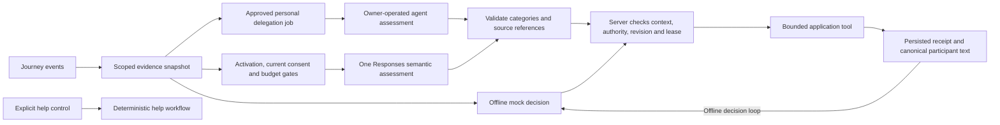

# StillHere AI scope and authority

Current direction: [StillHere](STILLHERE.md) prioritizes [volunteer-owned personal agents](PERSONAL_AGENT_GUARDING.md). Guardian request, rider approval, scoped capability tools, the local watcher, and a STDIO MCP bridge are implemented. The backend and interface are deployed, and a [hosted acceptance run](deployment/personal-agent.hosted.validation.json) passed 23 checks with one real Codex assessment and human handback. This is bounded workflow evidence, not a model-quality benchmark or proof of chain finality. The API adapter below is a disabled optional path. [The sponsor review](SPONSORS.md) distinguishes Rox fit from the unconfirmed eligibility of a Codex-only runtime for OpenAI's API prize.

Updated September 20, 2026. The real OpenAI Responses adapter and controlled semantic execution path are implemented. **Live Responses processing remains disabled:** development, staging, and production configuration all set `OPENAI_ENABLED: "false"`. No paid Responses API validation or broad model-quality result is claimed. A key or consent alone does not activate the path. See [OPENAI_INTEGRATION.md](OPENAI_INTEGRATION.md) for exact limits and the future activation runbook, [AGENT_HARNESS.md](AGENT_HARNESS.md) for both execution paths, and [VALIDATION.md](VALIDATION.md) for test and deployment evidence.

## Purpose and award fit

AI should help people keep a journey accompanied: clarify uncertain messages, preserve relevant context, request human coverage, and prepare a useful handoff. The community remains centered on voluntary human participation. AI does not earn recognition or certify character.

The [official HTN prize description](https://hackthenorth2026.devpost.com/#prizes) makes Rox a plausible target for the personal-agent workflow. OpenAI's separate API requirement is not established by using a subscription-authenticated Codex runtime. The manual Codex demonstration establishes one real assessment, not continuous delegation or broad robustness. See [SPONSORS.md](SPONSORS.md) for the rechecked requirements and evidence gaps.

Rox's engineering guidance favors restricted data interfaces and repeatable snapshots. We can apply this to one journey's evidence and replay tests; a knowledge graph is unnecessary for the initial scope. See [Rox's controlled data interface](https://www.rox.com/articles/why-revenue-agents-are-uniquely-hard-to-build). Its [agent architecture article](https://www.rox.com/articles/how-we-build-agents-at-rox) also emphasizes correct data scope, typed actions, and simpler orchestration. These are engineering references, not additional competition rules.

## Implemented personal-agent path

The platform exposes six journey-scoped operations: `status`, `accept`, `updates`, `heartbeat`, `assess`, and `release`. An assigned guardian requests a named agent for 5–120 minutes; the rider approves that exact delegation under `personal-agent-v1`. Only then can the guardian download an expiring capability for their runtime. The Worker stores its verifier; neither the model nor a public projection receives it. An ordinary account session cannot substitute for this capability, and the capability cannot call ordinary participant APIs.

`accept` enters `connecting`; the first valid source-cited assessment establishes `active` coverage. Heartbeats prove connectivity only. A 45-second connectivity limit and an initial/pending response deadline of at most 90 seconds independently expose stalled execution. New input replaces stale work without extending its original response deadline. Human return, replacement, closure, explicit help, assistance being turned off, revocation, expiry, or unavailability stops the delegation. Identical accepted-job retries return the existing receipt only while current authority remains valid; changed or stale replay is rejected.

The owner-operated watcher supplies bounded repeated assessments as new jobs arrive. Defaults are 12 turns or 20 minutes; the server delegation can end earlier. Its isolated model subprocess has a 60-second deadline. These limits are not a token or credit guarantee. The separate STDIO MCP bridge exposes the same tools to an existing compatible agent but starts no model or background listener itself. See [the client guide](PERSONAL_AGENT_CLIENT.md) and [HTTP contract](PERSONAL_AGENT_PROTOCOL.md). Remote hosted-agent integration and universal model quality are not implied.

Each job contains at most 12 eligible messages from the current rider and owning guardian plus eight retained rider concerns. Both participants' personal-agent approvals authorize this processing; the optional API's v2 consent is a separate choice. Withdrawal uses delegation revocation. Source-valid proposals select categories and references, not free-form claims. The server renders attributed questions and records actual concern, question, recruitment, and follow-up effects. These tools expose no contact notifications, wallet operations, guardian approval, or recognition awards.

## Platform foundation and disabled Responses path

The implementation has five validated tools, durable runs, action receipts, context and revision checks, bounded retries, and participant-only traces. `worker/src/agent.ts` defines the execution protocol and evidence; `worker/src/agent-provider.ts` bounds offline decisions; `worker/src/trips.ts` owns execution and authority. `worker/src/openai-provider.ts` implements the real Responses request, `worker/src/agent-semantic.ts` validates its source-cited proposal, and `worker/src/ai-runtime.ts` converts an accepted assessment into the existing tool plan. The older assessment entry point remains rules-only. Current fixture and mocked-HTTP tests establish application behavior, not LLM comprehension or live-model quality.

The shared controls separate the following responsibilities:

- Explicit help runs deterministically. Inferred chat concern cannot authorize a contact notification; timeout contact needs a separate rider opt-in and valid notification consent.
- Rider assistance choices separate automated check-ins, timeout contact, personal-agent delegation, and optional API processing. API processing requires the current v2 notice; personal delegation requires the separate v1 request and approval. Omitting structured identity fields does not remove personal information typed into chat.
- Platform offline decisions and Responses requests have active abort signals, eight-second deadlines, renewed 15-second persisted leases, and revision checks. The Responses path additionally reserves journey and global budgets before dispatch and records provider-reported token usage separately. Personal-runtime limits are independent of those platform budgets.
- A successful context read precedes effects. The model may select a semantic topic, source references, and question category; participant-facing questions and handoffs use canonical server text and quotations. Only server receipts establish completed actions.
- Up to eight unresolved concerns retain source identifiers and observed/received timestamps beyond the recent-message window. Only an explicit rider resolution clears a retained concern.

`createMockProvider()` remains the offline decision source and fallback. The generic offline boundary still refuses providers marked live, and its legacy `createDisabledOpenAIProvider()` stub still rejects immediately. The real adapter is a separate, gated path: one strict Responses assessment per eligible platform run, followed by server execution. `OPENAI_ENABLED` is false in every checked-in environment. The personal watcher handles multiple independent, bounded jobs; neither path implements free-form model conversation or multi-agent orchestration.

## Rider assistance choices

Personal-agent consent uses the separate `/api/trips/:id/delegation` request, approval, and revoke actions. The API choices below neither grant nor withdraw that delegation. Disabling `automatedCheckIns` stops both forms of automated assistance.

The rider updates choices through authenticated `POST /api/trips/:id/assistance`. Boolean fields are strict; strings such as `"false"` do not count as consent. The defaults are:

| Field | Default | Meaning |
| --- | --- | --- |
| `automatedCheckIns` | `true` | Permit bounded automated check-ins when coverage policy allows them |
| `timeoutContact` | `false` | Opt into the server timeout-contact policy; separate notification consent is also required |
| `liveAiConsent` | `false` | Rider processing choice; requires the current notice and separate server activation |
| `noticeVersion` | `openai-assistance-v1` | Legacy default; live eligibility requires fresh `openai-assistance-v2` acceptance |

The authenticated participant processing endpoint is `POST /api/trips/:id/ai-consent`, with `{ "consent": true, "noticeVersion": "openai-assistance-v2" }` to accept or the same body with `consent: false` to revoke. Participants change only their own choice. An old v1 preference never activates live processing. The rider's current choice gates the request; only messages from the current consenting rider and current consenting guardian enter the external snapshot. Candidates, former guardians, nonconsenting authors, and agent/system text are excluded.

Processing consent remains separate from community publication and trusted-contact notification consent. Turning automated check-ins off cancels pending agent work. Ordinary human controls and explicit help remain available. Participants must receive the actual provider-transfer and retention notice before accepting v2. Revocation prevents future processing and invalidates pending work; it cannot recall an already transmitted request.

## Intended product behavior

Use one journey-scoped assistant with a small tool set. A future participant-requested summary while a human is active remains separate from autonomous monitoring. Automated follow-up begins only when the server's coverage policy and rider choice permit it. A missed check-in means contact is overdue; it does not establish that the guardian is asleep or the rider is unsafe.

| Capability | Useful result | Boundary |
| --- | --- | --- |
| Interpret the rider's current concern | Select a relevant bounded question category and retain source-linked unresolved concerns | Semantic quality remains unmeasured; no diagnosis of danger from stale location or ambiguous wording |
| Reconcile journey evidence | Identify old reassurance, newer concern, conflicting statements, and missing information | Do not invent route telemetry or silently discard conflicts |
| Request human coverage | Persist a recruitment request and show its actual status | No automatic guardian selection, approval, private access grant, or promised response time |
| Prepare a handoff | Give the approved next guardian a brief with sources, times, unresolved issues, and completed actions | Candidates do not receive private summaries; former guardians lose access |
| Follow up within limits | Send an attributed question and schedule an allowed follow-up | No replacement for the rider's own check-in; no unlimited reminders or spending |
| Explain action status | Render queued, provider-accepted, failed, and acknowledged results | No invented notification success or claim that help is on the way |

Human guarding and normal help controls must remain usable when live AI is declined, unavailable, or out of budget. Once a human takes over, the server cancels autonomous pending work and rejects late model actions against the previous revision.

## Evidence and execution design

Interpretation paths share source validation and server-owned effects. Personal delegation is implemented; the optional Responses branch remains disabled:

Cloudflare remains the owner of permissions, timers, consent, run state, and effects. The model receives no session bearer token, administrator key, issuer key, sponsor key, database connection, or general HTTP/shell capability. Journey identity is injected by the executor rather than chosen in tool arguments. The personal runtime holds its configured capability outside the model prompt. The older platform harness retains `get_journey_context`, `send_check_in`, `schedule_follow_up`, `request_human_relay`, and separately gated `notify_trusted_contact`; the personal capability exposes only its six protocol operations and cannot invoke that notification tool.

An evidence item should identify its source, actor role, event ID, observed and received times, and freshness. Server state establishes assignment, consent, and delivery status. A participant message remains that participant's claim. All journey messages, including system-looking text inside chat, are data rather than developer instructions. Unknown timestamps and unavailable location remain explicit unknowns.

The shared assessment protocol permits at most four findings, one question selection, a recruitment proposal, and a follow-up delay between 30 and 300 seconds. At most eight distinct supplied sources can be referenced. A new concern requires recent rider evidence; an older retained concern may remain unresolved. Conflicts need two distinct message sources. Unknown, future, ambiguous, and ineligible-author references are rejected. The model receives no field for granting contact authority or writing arbitrary action claims. The optional API adapter forces this proposal through the strict Responses function `propose_journey_assistance`; personal runtimes submit the same semantic object through `assess`. See [OpenAI function calling](https://developers.openai.com/api/docs/guides/function-calling).

The server validates the assessment and executes a bounded local plan; it does not return tool receipts in another paid model turn. The exact question wording and handoff prose remain server-generated from validated categories and quoted sources. Schema and source conformance do not establish whether the interpretation is correct. That requires the held-out evaluation described in [AI_DEMO.md](AI_DEMO.md).

Participant evidence shows source references, uncertainty, completed actions, and pending actions. Store concise evidence and receipts, not hidden chain-of-thought. The server renders canonical check-in and action-receipt text; provider prose cannot establish delivery or guardian assignment. The textual handoff contains server execution evidence and a pointer to the separate AI interpretation panel. The complete validated assessment and exact minimized source snapshot remain in `semanticHandoff` and are rendered independently, so a text-summary limit does not silently cut away semantic citations. Structured handoff references are validated against supplied evidence. Canonical server summaries are bounded to 4,000 characters; generic offline completion proposals have a separate 1,200-character bound and are not the trusted participant narrative.

The journey retains at most eight unresolved rider concerns, each with a source identifier, observed time, and received time. These records can outlive the recent-message window. New reassurance, a summary, or human handoff does not resolve them. The rider explicitly resolves one through `POST /api/trips/:id/actions` with `{ "action": "resolve-concern", "requestId": "<concern.id>" }`; the server records a resolution event tied to that source. This is bounded working context, not unlimited transcript retention.

## Authority and escalation

Escalation uses explicit causes; a shared risk label alone never authorizes contact:

| Cause | Handling |
| --- | --- |
| `explicit_help` | Run the help workflow immediately without waiting for a model; preserve active requests |
| `user_authorized_timeout_policy` | Apply the server timeout policy only with the rider's `timeoutContact` opt-in and separate notification consent |
| `model_concern` | Ask for clarification and request permitted human coverage; chat or rule/model inference cannot authorize a contact notification |

External contact requires the configured trusted recipient, a permitted escalation cause, and valid current notification authorization, checked again immediately before the effect. No model-selected recipient or URL is accepted. Provider acceptance is not proof of receipt or rescue. This work enables neither live AI nor external delivery; the two activation decisions remain separate. Simulated, disabled, failed, accepted, and acknowledged outcomes remain distinct. A rider response or restored human coverage stops unsent timeout-policy jobs; a routine reassuring check-in does not withdraw an explicit help request.

AI cannot confirm arrival, close a journey on someone's behalf, cancel an explicit help request, appoint a guardian, grant private access, impersonate a rider, or sign a chain transaction. It cannot award contributions, issue appreciation, withdraw recognition, rank character, or claim to be emergency dispatch. It cannot penalize a guardian because it inferred inattention. Recovery from urgent state follows an explicit product policy, not an arbitrary reassuring model response.

Community publication remains separate. Implemented versioned `agent_service` events record active, ended, unavailable, and human-return transitions with minimal references and system/owner provenance. They award no human contribution points; publication and chain finality need their own deployment evidence. Authorized server events may also record automated recruitment. Model opinions, concerns, conversations, and precise location never become public recognition evidence. AI interpretation and handoff data remain private to authorized current participants and follow the existing deletion policy.

## Data and resilience

Personal-runtime jobs use the same bounded context minimizer, with their own participant approvals. Their capability stays outside prompts and public views. Effects and receipts are committed atomically against the issued job/revision. Backup restoration discards private capabilities and pending jobs, closes old journeys, and ends delegation views. Personal runtimes use their own account and retention configuration; the Responses-specific `store: false`, leases, and budget controls below do not describe that account's processing.

The real provider, if explicitly enabled, receives at most 12 eligible participant messages and eight retained rider concerns in a minimized snapshot. Dedicated account and journey identifiers, contact addresses, wallet information, shared Uber URLs, exact coordinates, and notification details are omitted. Evidence identifiers remain for reference validation. Free-text redaction is heuristic and cannot guarantee anonymity or removal of all personal information. A consenting author can still quote another person. The offline path transmits nothing to OpenAI.

The real request uses `store: false`, foreground execution, and no conversation state. This does not grant Zero Data Retention: standard abuse-monitoring retention may still apply, and enhanced retention controls require separate account eligibility and approval. The processing notice must reflect the actual project configuration. See [OpenAI data controls](https://developers.openai.com/api/docs/guides/your-data) and the detailed [integration data boundary](OPENAI_INTEGRATION.md#consent-and-the-data-boundary).

Each decision has an eight-second deadline and a renewed 15-second persisted lease. Timeout and caller cancellation actively abort the provider signal, and late results or rejections are consumed without applying effects. After asynchronous work the runner reloads state and checks revision, ownership, lease, consent, and current context. Human resumption, assistance being turned off, closure, or changed participant intent invalidates obsolete work. Every effect requires a successful context receipt from that run.

The offline decision boundary limits serialized input to 32,000 characters and output to 8,000. Cumulative limits are 24 decisions and 120,000 input characters per run, plus 240 decisions and 1,200,000 input characters per journey. These persisted character/decision limits remain distinct from paid-call accounting.

The real path permits at most one assessment attempt per run, 12 reserved requests and 120,000 reserved token units per journey, and a ten-second request cooldown. The deployment-wide `AiBudgetLedger` permits at most 50 reservations and 500,000 reserved token units per UTC day across journeys. Each reservation is the full request body's UTF-8 byte count plus 1,200 output units, capped at 33,200. Requests are bounded to 32,000 bytes and responses to 64,000 bytes. Reservations are conservative guards, not measured tokens, dollar limits, or invoices. Actual provider-reported token usage is recorded separately; uncertain or aborted requests keep their reservation. A run never automatically purchases a second assessment. See [request and budget limits](OPENAI_INTEGRATION.md#request-time-and-budget-limits).

Budget exhaustion, malformed output, refusal, timeout, or provider failure leaves a recorded fallback with ordinary human controls and help available. Tool steps, local retries, run age, and reminders remain bounded. Refresh stale evidence before effects, deduplicate committed local actions with stable IDs and receipts, and discard late results after handoff, consent changes, assistance being turned off, or closure. Model/request IDs, prompt versions, validated assessments, usage, and safe failure codes remain in private, bounded operational records without credentials. Recovery can resume local tool work; an interrupted reserved paid attempt becomes `AI_INTERRUPTED` and is not redispatched. Its conservative reservation remains charged. Recovery cannot restart erased/restored unattended work.

## Evaluation and demonstration

For the primary personal-agent path, the 30-test backend suite and separate client/interface tests exercise authorization, deadlines, freshness, privacy, replay, and receipts without real inference. Separately, the [hosted watcher run](deployment/personal-agent.hosted.validation.json) passed 23 checks with two synthetic accounts, one real model invocation, and a two-turn/two-minute limit. The 8.683-second assessment selected a cited route concern; the server posted a canonical question and scheduled follow-up. Human return revoked the capability, then arrival and a free banner completed the flow. Agent execution left human check-in counts unchanged. Hosted Responses API calls and external notifications were zero. Broader scenarios, failure rates, interactive browser acceptance, and independently finalized chain records remain unmeasured by that run.

Freeze journey snapshots and, after explicit activation, evaluate the implemented adapter against the rule baseline. Begin with a labeled scenario set and hold back variants from prompt tuning. Include negations, typos, conflicting accounts, late and duplicate events, stale location, removed participants, consent revocation, malicious instructions, unavailable providers, and handoff during an outstanding model request. Measure source-grounded interpretation, useful question selection, valid tool execution, duplicate effects, false success claims, latency, and token usage. Current contract tests and mocked Responses fixtures do not establish these model-quality results. See [AI_DEMO.md](AI_DEMO.md) for the demonstration and measurement plan.

Critical release checks include zero unauthorized cross-journey access, no model access to signing keys or direct transaction execution, no model-awarded or model-withdrawn recognition, and no bypass of contact authorization in the evaluated cases. Authorized system events may still be published by the existing issuer/sponsor workflow. Passing a finite test set is not a real-world safety certification. Explicit help must work with the model disconnected.

An authorized live demonstration should create actual application events: a guardian misses a check-in; earlier reassurance is followed by a newer rider concern; location is unavailable or stale. The model selects a relevant topic, sources, and question category; the server renders the question and executes any permitted recruitment proposal. The rider approves a volunteer who receives an attributed handoff. A change over time is not automatically a contradiction. Show real model/tool traces, action receipts, and that automated follow-up stops when the human returns. Attribute an already-open relay to the server workflow that opened it. The current mock cannot supply live-model evidence.

A second demonstration introduces a provider timeout or failed notification and verifies honest status plus uninterrupted human controls. Synthetic or perturbed data must be labeled as such; real application events are not proof of a real emergency. Obtain permission before using any real person's messages or journey information. Sponsor-specific acceptance of a dataset remains a judging decision.

For the OpenAI development story, preserve one concrete Codex example: the separate withdrawal receipt that avoids consuming ordinary event sequence numbers, its regression tests, and verified deployment evidence. Also preserve actual model and tool traces after live integration; development assistance alone is not evidence of application API execution.

## Optional API activation and validation still required

1. Preserve and validate both offline and mocked-HTTP coverage of authority, context-first execution, strict semantic references, cancellation, accounting, recovery, and privacy.
2. Freeze held-out scenarios, verify the provider project's data/retention configuration, and obtain fresh v2 consent from included participants.
3. After credits and the user's explicit activation instruction, configure the key through the secret store and enable only the reviewed environment. Follow [OPENAI_INTEGRATION.md](OPENAI_INTEGRATION.md#future-activation-runbook--not-executed-by-this-change).
4. Run bounded real-model evaluations and a complete application workflow. Record actual IDs, reported usage, latency, outcomes, and failures; keep mock and live evidence separately labeled.
5. Consider voice, additional retrieval, or external delivery only after the core handoff workflow and authority checks are demonstrated.

Personal assessment uses existing application permissions and receives no authority over community recognition. The community program implementation adds versioned automated-service events; deployment and independent chain verification remain separate from a successful local or hosted assessment. Private concerns, conversations, and handoffs never become chain evidence.
