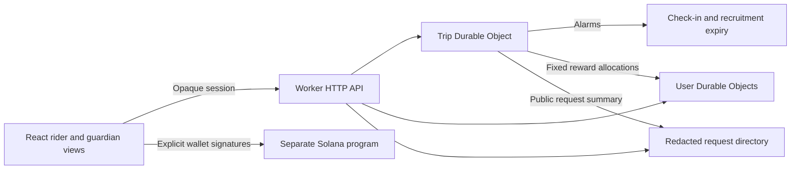

# Architecture and trust boundaries

> Historical architecture before the integrated V2 update. See [ARCHITECTURE_V2.md](ARCHITECTURE_V2.md) for the current identity, relay, chain synchronization, and operations design.

StillHere currently focuses on rider-approved human guarding and relay. AI/provider integration work is deferred. This document describes the core design; [VALIDATION.md](VALIDATION.md) records actual checks and [HUMAN_GUARDING.md](HUMAN_GUARDING.md) explains the user-facing rules.

## Components

| Area | Responsibility |
| --- | --- |
| `web/` | React/Vinext views, same-origin API proxy, candidate review, guardian relay, messages, location, and contribution presentation |
| `worker/` | Session authorization, trip state, application/relay decisions, alarms, redaction, and reward settlement |
| `chain/` | Solana transaction encoding, account reads, and test-network verification |
| `contracts/` | The deployed single-guardian Anchor program |
| `docs/` | Behavior, API, evidence, and presentation guides |

The frontend proxies requests to the separately running Worker. Local Durable Object state persists under the Worker's local runtime directory; cloud persistence and continuous cloud execution require a separate deployment. A closed browser does not stop an active backend alarm, but stopping the local Worker does.

## Identity and authorization

The original flow used guest sessions. The current account update adds username/password registration and sign-in, same-account upgrades for authenticated guests, and optional wallet login/recovery; see [IDENTITY.md](IDENTITY.md). Sessions remain opaque bearer credentials, not verified real-world identities. They expire after 30 days and are stored as SHA-256 digests on the backend. Passwords use a salted hash verifier in protected account storage. The frontend uses tab-specific session storage; duplicate tabs may inherit the same credential. Registered users can sign in again after session loss. There is no email password-reset provider or real-world identity verification.

The rider approves who becomes the guardian. An invitation links to a request; it is not itself a grant of private access. An authenticated account, including a compatible guest, may see a redacted available request and apply, subject to the pending-candidate limit.

Pending applicants receive only the redacted request and their own application. An approved current guardian receives the private trip. A replacement approval revokes the old guardian's future private reads and participant actions. Previously seen or copied data cannot be recalled.

Wallet ownership is a separate authorization system. Guest sessions are not cryptographically bound to wallet addresses.

## Trip state and recruitment state

Keep the journey lifecycle separate from recruitment and availability:

| Concern | Meaning |
| --- | --- |
| Journey lifecycle | Open request, active journey, rider-confirmed arrival, or cancellation |
| Current assignment | The person most recently approved by the rider |
| Availability mode | Human check-in mode versus automated rules/reminder mode |
| Candidate application | A volunteer's pending request for approval, with its own expiry |
| Relay request | A ten-minute window for replacing the current guardian |
| Contribution | Cumulative explicit participation by a distinct guardian |
| Reward allocation | A fixed share recorded once after eligible completion |

The initial request expires after 24 hours. Applications expire after five minutes or when their associated request expires, whichever comes first. At most five pending applications exist per trip.

A missed guardian check-in or explicit unavailability opens relay recruitment and changes the reminder mode. It does not manufacture a replacement. The current guardian stays assigned until a rider-approved handoff and may be marked overdue during that period.

The legacy `guardMode: "ai"` field denotes the automated companion path. The [offline agent harness](AGENT_HARNESS.md) uses deterministic mock decisions, durable tool execution, and private action traces. Live model calls are disabled even when a key exists. This mode is not evidence of model execution or continuous human protection.

## Atomic rider approval

Applications target a particular request identifier: the initial trip request or a relay instance. Approval validates that the application still exists, is pending, and belongs to the current unexpired request.

Within the trip's authoritative state update, approval assigns the selected guardian, closes recruitment, clears competing applications, and starts the new check-in window. A stale application must not replace a newly approved guardian. The outgoing guardian's access is based on the current assignment, not historical participation. Private responses re-check current authorization after asynchronous work, including optional voice generation. Former guardians retain their own profile balance through My impact.

Rider and current guardian may request a relay. Only the rider approves or rejects candidates. Applicants may withdraw themselves. Relay cancellation or expiry clears its applications while preserving the assignment and current monitoring mode. Explicit guardian resumption does not silently cancel an open relay.

Former guardians can apply again, but must be approved again. Their contribution is cumulative under the same guardian ID rather than a fresh reward participant.

## Alarms and recovery

The trip Durable Object persists timing state and schedules server alarms for check-in deadlines, recruitment expiry, monitoring limits, and pending recovery work. Reads and mutations must respect current expiry, rather than assuming an old browser view is authoritative.

Reminder events describe uncertainty and missing responses. GPS freshness is separate from human availability. An unchanged location does not establish danger, and an active relay does not establish that someone is watching.

Arrival, cancellation, or terminal expiry ends recruitment and prevents pending candidates from acquiring access. Settlement and directory synchronization can be retried from persisted work. Any existing notification adapter remains separate; the human flow does not require credentials or a real external recipient.

## Fixed contribution accounting

An ordinary rider-confirmed trip has one pool of 25 app points and 10 reputation. Only distinct approved guardians with an explicit check-in or resumption qualify.

Sort eligible guardian IDs lexically. For each pool, assign `floor(pool / participantCount)` units to every participant, then one extra unit to the first `pool % participantCount` IDs. The allocation is deterministic and preserves the fixed total.

The trip persists the allocation before crediting user accounts. Each user's credit ledger is keyed by the trip, so retrying settlement cannot credit that person again. Handoffs and repeat stints do not multiply rewards. No eligible guardian, cancellation, or demo mode produces no real allocation.

There is no cumulative guardian cap beyond the five pending-application limit. Participants may receive zero from a pool if their count exceeds its units. The scheme recognizes recorded participation; it does not measure attention quality, duration, distinct human identity, or freedom from collusion.

## Compatibility with existing trip data

Stored schema version 1 upgrades lazily to version 2. Its existing guardian remains assigned, pending applications start empty, and no relay is fabricated. Legacy eligibility or an already-credited reward reconstructs one compatibility check-in for that guardian. Previously credited amounts remain settled and are not issued again; uncredited terminal records normalize through the allocation logic.

This preserves local history without claiming that older assignments had rider approval or verified identities.

## Data boundaries

Exact route, position, contact data, conversation, and Uber links remain in the application backend. Public request summaries omit those fields. A rider-supplied Uber link is not fetched for telemetry; browser location sharing requires the rider's permission.

A newly approved guardian receives private trip access. Rider approval is an explicit sharing decision, but it is not identity vetting. Current retention/deletion and credential-storage behavior is described in [DATA_POLICY.md](DATA_POLICY.md). Exported backup snapshots exclude username/password and session credentials, so they cannot restore password-only account access; wallet-linked access requires the corresponding wallet registry. See [IDENTITY.md](IDENTITY.md) for recovery limits. Real-world identity verification remains outside the prototype.

## Separate Solana commitment

Solana holds a public wallet-signed commitment to one designated guardian. The program supports create, accept, signed check-in, rider completion, and cancellation. A completed task with an eligible signed check-in awards 10 non-transferable chain points exactly once.

The [local-validator](deployment/verification.localnet.json) and [Devnet](deployment/verification.devnet.json) lifecycle reports passed, and the downloaded deployed bytecode matches the build. This is existing evidence for that single-guardian contract, not validation of app relay or browser-wallet interaction.

The human-relay update does not redeploy the program. The app's new guardian does not automatically become the guardian of an existing chain commitment, and the chain does not split its reward among app participants. App points and chain points remain separate. Users share the public receipt fields manually and sign their own wallet actions; no AI or backend wallet impersonates a participant.

## Verification boundaries

| Claim | Evidence needed |
| --- | --- |
| Candidates cannot see private data | Redacted list/read/application responses before approval |
| Rider chooses the guardian | Wrong-role approval rejection and a valid rider approval |
| Relay is atomic | Competing/stale approval checks and old-guardian access rejection |
| Timers work without a browser | Durable Object alarm checks and expiry behavior |
| Rewards stay fixed | Multi-guardian allocation, returning-guardian deduplication, and exact-once credit checks |
| App and chain remain separate | No app relay transaction or automatic wallet binding claimed |
| Browser workflow works | Actual interaction evidence, separate from HTTP and typechecking |

Use [worker/API.md](../worker/API.md) for precise action names and request payloads. This remains a coordination prototype, not an emergency dispatch service or a guarantee of safety.
