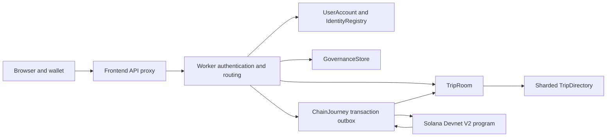

# Human guarding architecture, version 2

Safety Guard separates private coordination from public commitments. The browser hosts the user interface and asks the user's Solana wallet to sign. A Cloudflare Worker authenticates accounts and coordinates private journeys through SQLite Durable Objects. The separate V2 Solana program stores assignment and reward evidence. The website and its private database are not deployed into a Solana program.

The [community ledger](COMMUNITY_LEDGER.md) adds a separate publication path for free walletless participation: transactional TripRoom intents feed per-journey CommunityLedger journals, dedicated issuer/sponsor keys publish minimal platform attestations, and per-member indexes expose finalized recognition. This document describes the retained V2 wallet-signature path. Its protocol receipts are not added to community-ledger points.

## Implementation and deployment status

The four implementation areas now have code: wallet identity/recovery; V2 relay and reward contracts; a durable transaction coordinator; and deployment, retention, moderation, and encrypted recovery tooling. The V2 SBF binary and IDL have built successfully. The separate program address is `23f7UAfNbQCGdfQbJV3Tois98dETDfXnAXgjE5qTH5gb`, deployed on Devnet: [deployment transaction](https://explorer.solana.com/tx/4BPSQeaXMjSTtC7HUHYCtpHA6KqR7MMDK6YonxzJMaVahPwbfQBGYRnpAmQEPiQUtJgDGWu2rd6X4UXnisrA6CoN?cluster=devnet). The existing V1 deployment is preserved.

Both the [local validator report](deployment/verification.v2.localnet.json) and [Devnet report](deployment/verification.v2.devnet.json) record 19 signed transactions and 11 expected rejected operations. The [local application report](deployment/application.v2.localnet.json) covers 10 finalized transactions through the backend, private-access handover, and one shared 25-point / 10-reputation pool. The production Worker and owner-only frontend are published, with five passing hosted human-guarding HTTP workflows and 36 hosted identity checks; see the [hosting receipt](deployment/hosting.production.json).

The [complete signed hosted verification](deployment/application.v2.hosted.devnet.json) passed 14 checks and 10 finalized journey transactions through the production Worker and Devnet, including relay, former-guardian access revocation, and exactly one shared reward pool. Its three synthetic accounts and private journey were deleted. Separately, all 17 unsigned preparation checks passed through both the Worker and frontend proxy. A private Helius Devnet RPC is configured; see [RPC_SETUP.md](RPC_SETUP.md) for endpoint rotation. Browser wallet-extension acceptance remains a manual check.

## Recoverable identity

Each person has a stable application account ID. Guest creation issues a revocable bearer session. Binding a wallet requires an expiring, single-use signed message that includes the domain, operation, account ID, current wallet, authorization version, and nonce. The backend verifies Ed25519 signatures and reserves each wallet for one account. Signing in from another browser returns the same account rather than creating another score record.

Wallet rotation requires a signature from the new wallet and either proof from the old wallet or the current recovery code. A successful identity change revokes previous sessions and replaces the recovery code. A lost session can be recovered with a recovery code plus control of the replacement wallet. Store recovery codes privately; they are shown when issued, never retrievable as plaintext from the server. The [identity specification](IDENTITY.md) describes exact endpoints and concurrent-update protections.

Wallet rotation changes future application authentication. It does not transfer authority over already-created on-chain journeys. Their rider/guardian wallet addresses are immutable evidence. Use the original wallet for those outstanding public commitments or create a new journey where appropriate.

## Private journey and relay ownership

`TripRoom` owns current private access, applications, chat, check-in deadlines, relay requests, and closure. Each journey has its own object, so unrelated journeys do not serialize through one global coordinator. `TripDirectory` holds minimal sharded summaries; the account keeps its own journey index. A directory entry never grants private access.

An ordinary unlinked journey uses rider approval inside the application. A linked journey additionally requires the rider's on-chain proposal and the candidate's on-chain acceptance before private access changes. The previous guardian stays responsible while a replacement is pending. Confirmed handover revokes previous private access and starts the replacement's monitoring window. Application/proposal identity and sequence numbers prevent a delayed old acceptance from silently replacing a newer guardian.

Help, ordinary check-ins, chat, and ending monitoring remain available without waiting for a wallet transaction. A failed or slow RPC must not block a passenger asking for help or marking arrival. Rule-based monitoring can surface reminders and open a relay request. It is not an AI model or an emergency dispatcher.

The [offline agent harness](AGENT_HARNESS.md) now runs inside the same `TripRoom`. It persists bounded mock decisions, allowlisted tool calls, results, follow-up alarms, and private handoff summaries. Local tool effects and their receipts share one synchronous SQLite write. New participant intent, closure, human resumption, or changed location/notification context invalidate obsolete work. A configured OpenAI key cannot enable model calls in this release; deterministic fixture results are not live-LLM evaluation evidence.

## Public contract and one reward pool

The [community v1 layer](COMMUNITY_V1.md) uses existing account and journey objects. `UserAccount` exposes an authenticated, explicitly projected member profile with no visibility toggle; `TripDirectory` carries a limited `riderProfile` reference for review before application. Private trip authorization remains separate. For optional free appreciation after closure, `TripRoom` persists a unique receipt before an idempotent account write, records acknowledgement, and retries pending work through its existing alarm. Public profiles expose category counts without senders or journey references. Appreciation never credits points, triggers a payment, or changes the deployed program. Backups retain recorded ledgers but cancel pending deliveries on restore.

V2 uses a separate program address. The deployed V1 single-guardian demonstration remains historical and is not silently upgraded or reused as the V2 contract.

The V2 journey address derives from the rider wallet and a server-persisted random 32-byte reference. It records the current/proposed guardian, assignment revision, handover sequence, completion state, and up to 16 distinct guardian contributions. Returning guardians reuse their contribution entry. The rider proposes a guardian, and that guardian accepts the current revision before the proposal expires. Stale revisions, wrong signers, replayed transitions, and claims before completion are rejected by the program.

A signed on-chain contribution check-in qualifies a guardian for the linked reward pool. Ordinary app check-ins support monitoring but are not represented as a blockchain signature. When the rider completes the public journey, the program divides at most 25 points and 10 reputation across distinct qualifying guardians. The deterministic ordering of wallet bytes determines integer remainders. There is one pool per journey; multiple handovers or repeated check-ins do not increase it.

Each allocation can be claimed once. A claim pays no cash; it updates public reputation counters. A transaction payer may fund another guardian's claim, but cannot redirect the credited identity. The backend mirrors finalized claimed allocations into an idempotent per-account ledger. Linked journeys do not also mint the ordinary app-only reward. Community points are not a fungible token, monetary promise, or proof that an unsafe event could not occur.

## Durable chain synchronization

`ChainJourney` stores the public program/network/reference mapping and each transaction intent before external submission. It prepares an unsigned transaction for an authorized operation, expected revision/sequence, payer, and recent blockhash. The wallet signs those exact message bytes. Submission rejects changed instructions or a different signer before forwarding to RPC.

The persisted intent lifecycle is `prepared -> submitted -> confirmed`, with explicit `failed` and `expired` outcomes. The server retains the signature and signed bytes for an interrupted submission. A retry first checks the original signature. If still valid and unseen, it can resend the same signed transaction rather than producing a second independently signed operation. Once blockhash expiry is established, the user can prepare a new transaction. An unsigned intent can be discarded; an already submitted transaction cannot be canceled merely by hiding it in the UI.

Object alarms continue reconciliation after the browser closes. Finalized account reads verify the program owner, rider/reference, and observed slot before updating private assignment/reward state. Confirmed chain state controls public commitments; local monitoring state controls help and closure. The UI presents pending or failed synchronization explicitly, so local arrival is not falsely displayed as a finalized reward claim.

## Operations and recovery

Independent staging/production Worker namespaces isolate private data and keys. Runtime readiness fails closed for incomplete hosted configuration. Operator APIs provide categorical reports, suspension, audit records, export manifests, and isolated recovery. The code includes a dry-run/deployment/explicit-version rollback CLI and authenticated encrypted backups.

Closed private journeys expire after 30 days, or 7 days for demos. Account erasure uses a persistent journal, and purged objects keep minimal tombstones. Restore validates schemas before writes and merges erasure protections first. It never restores bearer credentials or silently resumes an old active journey. Recovery procedures require the latest source deletion journal even when selecting older data. See [operations](OPERATIONS.md) and [data handling](DATA_POLICY.md) for retention, recovery limits, and operator responsibilities.

The implementation remains a Devnet prototype. Production hosting, browser-wallet acceptance, load testing, independent contract security review, and emergency-service operations are separate release evidence. Do not infer them from successful unit tests or a local contract build.
