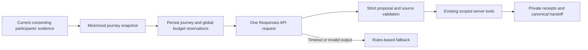

# OpenAI integration: implemented, disabled, awaiting live validation

Updated September 20, 2026. The real Responses API adapter and its server integration are implemented locally. **Live calls remain disabled:** checked-in development, staging, and production configuration all use `OPENAI_ENABLED: "false"`. No paid model request, model-quality evaluation, or activation is claimed by this document. Deployment and test evidence are recorded separately in [VALIDATION.md](VALIDATION.md).

The product purpose is to preserve relevant context while people arrange voluntary guardian coverage. The model proposes interpretations and a useful follow-up; the server owns permissions, timeouts, contact authority, execution, and factual receipts. The rider chooses who receives the next assignment.

## Request and execution path



[`openai-provider.ts`](../worker/src/openai-provider.ts) sends a foreground, nonstreaming `POST` to `https://api.openai.com/v1/responses`, with `store: false`, `background: false`, and an output limit of 1,200 tokens. It forces one strict function named `propose_journey_assistance` and disables parallel tool calls. The application rejects unexpected output items, refusals, incomplete responses, malformed usage, forged references, and unknown model IDs. This uses the documented Responses function interface; the server still validates the returned proposal independently. See [OpenAI function calling](https://developers.openai.com/api/docs/guides/function-calling) and [Responses API migration guidance](https://developers.openai.com/api/docs/guides/migrate-to-responses).

There is at most one paid assessment attempt per durable run. After that assessment, [`ai-runtime.ts`](../worker/src/ai-runtime.ts) turns the accepted proposal into the existing scoped tool plan. Tool receipts are not sent back in another model turn. This is one journey-scoped assistant, with no multi-agent delegation, continuous free-form conversation, general HTTP tool, browser, MCP connection, or wallet capability.

The five existing tools remain `get_journey_context`, `send_check_in`, `schedule_follow_up`, `request_human_relay`, and `notify_trusted_contact`. The semantic proposal can select a question, suggest eligible recruitment, and propose a bounded follow-up delay. It cannot propose a notification recipient or grant contact authority. Explicit help and the separately authorized timeout-contact policy remain deterministic server workflows.

## What the model can return

[`agent-semantic.ts`](../worker/src/agent-semantic.ts) requires all fields and rejects extra properties:

| Field | Accepted content |
| --- | --- |
| `findings` | Up to four `concern`, `conflict`, `reassurance`, or `uncertainty` findings, each with a topic and source references |
| Finding topic | `route`, `companionship`, `availability`, `wellbeing`, or `location` |
| `question` | One of `route_explanation`, `companionship`, `current_feeling`, `location_update`, `ability_to_reply`, or `none`, with source references |
| `requestRelay` | A Boolean proposal; current server policy determines whether recruitment can open |
| `followUpSeconds` | An integer from 30 through 300 |

Each source list contains at most four distinct references; the whole assessment may cite at most eight distinct sources. References must match supplied `message:<id>` or `concern:<id>` records. Agent/system messages, unknown references, ambiguous duplicates, and future timestamps cannot establish evidence. A new concern needs rider messages from the preceding five minutes; an existing retained rider concern can remain relevant when older. A conflict needs at least two distinct message sources. Question references must identify a recent rider message or a retained rider concern. Limited source-free questions require an appropriate server condition, such as stale location or active automated coverage.

The model selects the question category and its supporting sources. The server writes the actual question from fixed wording and a short, delimited, redacted source excerpt. The handoff similarly renders topic labels, quotations, actor roles, observed/received times, and uncertainty. **It accepts no arbitrary model prose claiming delivery, assignment, safety, rescue, arrival, or completed actions.** A valid reference proves that a source exists, not that the interpretation follows from it; semantic quality still requires evaluation.

The default model is `gpt-4.1-mini`; `gpt-4.1-mini-2025-04-14` is also allowlisted for a pinned evaluation. OpenAI documents function calling, structured outputs, and this snapshot for GPT-4.1 mini. Model availability for the actual project must still be checked during authorized activation. See the [GPT-4.1 mini model page](https://developers.openai.com/api/docs/models/gpt-4.1-mini).

## Consent and the data boundary

Live eligibility requires all of the following: server enablement, a configured key, an allowlisted model, an open journey under automated coverage, automated check-ins enabled, and the rider's current processing choice. An active explicit-help request bypasses semantic assessment.

The processing notice is `openai-assistance-v2`. A stored `openai-assistance-v1` choice **does not authorize live processing**. The rider must accept the current notice; a guardian independently controls inclusion of their own messages. The external snapshot includes only messages authored by the current consenting rider and the current consenting guardian. Former guardians, applicants, nonconsenting authors, and agent/system messages are excluded. A consenting participant may still quote another person in free text; filtering the author does not eliminate that possibility.

The snapshot includes at most 12 eligible messages and eight retained rider concerns. Structured account and journey identifiers, contact addresses, wallets, shared ride URLs, precise coordinates, notification details, and credentials are not sent. Evidence IDs remain so a returned reference can be checked. Free text is bounded and heuristically redacted for recognizable URLs, email addresses, phone numbers, credentials, wallet-like identifiers, and coordinate pairs. **This is minimization, not guaranteed anonymity.**

`store: false` disables storage of the response for later API retrieval; it does not grant Zero Data Retention. Standard abuse-monitoring retention can still apply. OpenAI's current documentation describes retention of abuse-monitoring content for up to 30 days by default, with stated exceptions, and separate eligibility/approval for enhanced retention controls. Do not claim that this project has those controls without verifying its account configuration. See [OpenAI data controls](https://developers.openai.com/api/docs/guides/your-data).

Revocation prevents future eligible processing and invalidates pending work; an already transmitted request cannot be recalled. Private journey traces retain the validated assessment, source snapshot, model/prompt identifiers, request/response identifiers when available, usage, safe failure codes, and actual tool receipts. They follow private journey access and deletion rules. Model interpretations, chat excerpts, and private handoffs do not become public community-recognition evidence or chain data. The global budget ledger retains reservation metadata, not conversation content.

## Request, time, and budget limits

| Boundary | Current limit |
| --- | --- |
| Paid assessment attempts | One per durable run; no automatic paid retry inside that run |
| Request body | At most 32,000 UTF-8 bytes |
| Provider response | At most 64,000 bytes |
| Model output | At most 1,200 tokens |
| Active request deadline | 8 seconds, with abort and late-result rejection |
| Persisted ownership lease | 15 seconds, renewed before dispatch |
| Per journey | At most 12 reserved requests and 120,000 reserved token units |
| Per journey cooldown | At least 10 seconds between reserved requests |
| Global ledger | At most 50 reservations and 500,000 reserved token units per UTC day |

Each reservation equals the full serialized request body's UTF-8 byte count plus 1,200 output units, capped at 33,200. These conservative **reserved token units are not tokenizer output, a dollar limit, or an invoice**. Provider-reported input/output/total token usage is recorded separately when available. Reservation accounting does not refund unknown, failed, or aborted provider work. A reservation can also remain charged when dispatch is superseded or denied later; this deliberately favors a hard local spending guard over maximum utilization.

[`AiBudgetLedger`](../worker/src/ai-budget.ts), owned by the single governance object, serializes global reservations across journeys. Duplicate reservation IDs cannot authorize a second dispatch. Global day limits use UTC, independently of participant timezones. Journey limits persist across runs. Baseline mock decisions also have separate persisted decision/character budgets; those are not paid-token accounting.

Human takeover, relevant participant input, processing revocation, or journey closure invalidates old run ownership and aborts active work where possible. A late result cannot acquire authority merely because the model finished successfully. Timeout, refusal, malformed output, unavailable credentials, exhausted budgets, and provider failures leave ordinary human controls and deterministic explicit help available.

## Future activation runbook — not executed by this change

1. Confirm credits, the intended OpenAI project, model access, and the actual retention configuration. Obtain the user's explicit instruction to activate paid requests. Keep `OPENAI_ENABLED` false until that instruction; implementation approval alone does not activate billing.
2. Review the current processing notice with test participants. Obtain fresh v2 consent from the rider and from any current guardian whose messages should enter the snapshot. Do not convert historical v1 choices into acceptance.
3. Configure the key through the environment's secret store. From `worker/`, the staging example is below. Enter the value at Wrangler's prompt; do not put it in chat, source, a command argument, a screenshot, or committed configuration. See [Cloudflare secret configuration](https://developers.cloudflare.com/workers/configuration/secrets/).

   ```powershell
   npx wrangler secret put OPENAI_API_KEY --env staging
   ```

4. After explicit activation authorization, change only the intended environment's `OPENAI_ENABLED` to `"true"` and choose an allowlisted `OPENAI_MODEL`. Preserve the budgets and keep `NOTIFICATIONS_ENABLED: "false"` for the first model evaluation. AI activation and external notification delivery are separate decisions. Deploy that reviewed environment through the normal release process.
5. Run one controlled journey with consenting participants and clearly labeled synthetic messages. Capture the actual provider/model/prompt identifiers, usage, timing, accepted categories, source references, canonical question, and resulting server receipts. Confirm a disabled or declined session still takes the fallback path. Follow [AI_DEMO.md](AI_DEMO.md) for the evaluation sequence.
6. Exercise revocation, human takeover, timeout, and budget fallback. Record failures honestly. A later independent run is not permission for an unlimited paid retry loop.
7. To stop live processing, restore `OPENAI_ENABLED: "false"` in the active environment and deploy the reviewed change. Revoke individual processing choices where needed. Existing billing or provider retention cannot be undone by switching the flag off.

## Evidence still needed

The existing automated tests use deterministic decisions, synthetic fixtures, and mocked HTTP responses. They validate request construction, strict contracts, authorization, source checks, cancellation, accounting, and fallback behavior. They do not establish real-model comprehension, latency, cost, answer quality, or successful acceptance of this exact request by a live OpenAI project. No live score or cost saving is claimed. Record those measurements only after explicit activation and actual evaluation.
