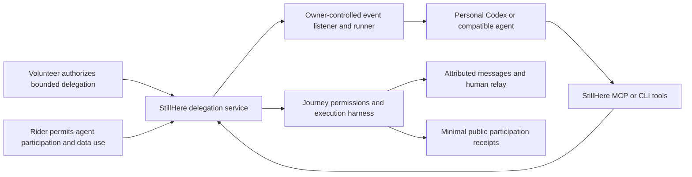

# StillHere: personal agents in a voluntary guarding community

Status: proposed architecture, September 20, 2026. This document records the new product direction. Guardian delegation, connected agent identities, continuous personal-agent execution, and delegation ledger events are not implemented yet.

## Product decision

StillHere should let volunteers bring their own agents into the community. A volunteer can tell their agent, "I need to sleep for a while. Please continue accompanying this rider." The agent uses narrowly authorized StillHere tools, while the platform manages permissions, continuity, human handoffs, and truthful records.

The name has two meanings: the volunteer is still here with the rider, and their personal agent can help continue that companionship when the volunteer rests. It expresses care and continuity, not a guarantee of uninterrupted monitoring or physical safety. The rider must be able to tell who is present, whether that participant is automated, and when nobody is responding. See [the product brief](STILLHERE.md) for the narrative and proposed demonstration.

A platform-funded model API is not a prerequisite or the main development path. The existing disabled Responses adapter is retained as an optional legacy integration. The product should work with a compatible personal agent client, beginning with Codex CLI. Support for another Codex surface must be verified against that client's actual tool and background-execution capabilities.

The owner's agent is still an automated participant. Its activity must be visible as such; connecting an agent does not establish that a person is awake or that the rider is safe.

## Intended experience

1. A human volunteer receives the rider's approval and begins an ordinary guarding assignment.
2. The volunteer asks their connected agent to cover a specific journey for a bounded period.
3. The platform checks the volunteer's current assignment and the rider's permission for that agent's participation and data processing. Natural-language intent alone is not a credential or a grant.
4. The agent obtains a limited delegation and confirms readiness. The interface shows whose agent is providing automated coverage, when it last responded, and when permission expires.
5. The agent reads authorized updates, asks useful questions, preserves unresolved concerns, and can request a human replacement. The rider still approves the replacement guardian.
6. Human return, replacement, arrival, cancellation, consent withdrawal, expiry, or loss of agent availability ends the delegation and invalidates outstanding proposals.

If the volunteer leaves before an agent or another person is ready, display the coverage gap and retain existing deterministic reminders. A voluntary participant is not forced to stay; the software must accurately report the resulting availability.

## Architecture

The platform exposes application capabilities. It does not expose a personal Codex session as a public inference service, receive a volunteer's ChatGPT authentication material, or charge one shared model account for arbitrary community input. Each agent owner operates their own compatible runtime and account.

MCP provides a standard tool interface; it does not by itself keep a model running, listen forever, or guarantee that a sleeping computer can respond. Continuous participation needs a running listener with event cursors, deadlines, retries, and reconnection handling. The first implementation should use a private operator-controlled local runner. Hosted personal runtimes can be evaluated later without sharing subscription credentials through the platform.

Codex CLI supports local STDIO and remote Streamable HTTP MCP servers with supported authentication methods. Hosted ChatGPT Work uses remote MCP through installed plugins, rather than reading local Codex configuration. This makes a platform tool adapter a supported integration direction; actual client pairing still needs implementation and validation. See the [official MCP documentation](https://learn.chatgpt.com/docs/extend/mcp).

Codex CLI goals and hosted Work support long-running tasks, so a dedicated local runner is an initial engineering choice, not a claim that these clients cannot continue work. Runtime availability and task pauses must still be observable. Local scheduled execution requires an available machine and application; hosted schedules depend on workspace features. Support for a custom StillHere event trigger is not established by those capabilities. See [long-running work](https://learn.chatgpt.com/docs/long-running-work) and [scheduled tasks](https://learn.chatgpt.com/docs/automations).

## Identity and authorization

Keep these identities distinct: rider, assigned human guardian, connected personal agent, and temporary delegation. A delegation belongs to one current guardian assignment and one journey; it is not a substitute for the owner's general application session.

Use a supported authorization flow to pair the agent with its owner, then issue a short-lived, revocable capability for specific tools. Store only a verifier for a bearer capability, redact it from logs, and keep it out of model prompts, source control, exported context and public receipts. Do not copy the owner's browser session or a Codex login into Worker secrets.

The rider must know which agent is participating and consent before private rider messages are processed by that external runtime. The guardian cannot grant processing consent for the rider. Include only explicitly eligible authors and relevant data; former guardians and applicants do not gain access through an old delegation. Free text still needs review and minimization.

Every action must recheck current assignment, rider consent, delegation expiry, journey revision, allowed tool, source freshness, and request idempotency. Revocation must reject both future requests and old in-flight proposals. Tool descriptions and agent instructions supplement these server checks; they cannot replace them.

## Initial tool surface

Names below describe proposed capabilities, not existing public endpoints.

| Capability | Allowed behavior | Required boundary |
| --- | --- | --- |
| List my assignments | Find the owner's current assignments using minimal summaries | No community-wide private journey access |
| Request delegation | Propose one journey and a bounded duration | Current guardian authority and rider permission; no silent activation |
| Accept delegation | Confirm that the connected agent is ready | Bind the agent identity and current assignment; expiring lease |
| Read journey updates | Read authorized context and events since a cursor | Minimal context, eligible authors, no unrelated accounts or credentials |
| Propose assistance | Submit cited findings and a bounded question/follow-up proposal | Reuse the strict semantic protocol and current-state validation |
| Request human relay | Open a replacement request where allowed | No assignment approval, private access grant, or claim that someone accepted |
| Report availability | Record runtime heartbeat and processing progress | Does not count as a human check-in or proof of attention |
| Release delegation | End the owner's agent participation | Stop pending work and update visible coverage immediately |

Initially retain canonical server wording and the existing source-cited assessment schema. Free-form companionship can be considered separately; it should not silently bypass the established execution boundary.

Agents receive no wallet-signing, transfer, award, account-administration, emergency-dispatch, or arbitrary outbound-message tools. Explicit rider help remains a direct platform action. Trusted-contact notifications remain subject to the existing separate consent and deterministic policies.

## Continuity and failure behavior

Record runtime connectivity, last processed event, last successful model response, and actual tool receipts separately. A heartbeat from a polling process does not prove that its model is functioning. A model response does not prove that a rider read the message.

Use a bounded delegation lease and a response deadline for pending events. Deduplicate retries using server-issued event and action identifiers. Do not keep renewing claimed coverage when an event remains unprocessed. On runtime loss, expired permission, unavailable model allowance, or an overdue required response, disclose that agent assistance is unavailable, retain deterministic reminders, and make human recruitment available under existing rules.

Do not promise continuous personal-agent coverage solely because an MCP connection was configured or an agent replied "I will watch the journey." The listener and recovery path need end-to-end validation with the client actually used for the demo.

## Community recognition and chain records

Agent support can be a meaningful community contribution, but it must be distinguishable from a person's direct participation. Display "Alex's agent provided automated support" instead of incrementing Alex's human check-in counter. A running heartbeat must never mint contribution points.

Preserve the existing human contribution and free-banner rules during the first implementation. Record automated service activity separately. Whether verified agent service should later have its own recognition measure is a product decision; it is not implemented or silently included in today's human scores. Rider gratitude remains voluntary and never purchases coverage.

Proposed public receipt events include delegation activated, agent participation ended, agent availability lost, and human coverage resumed. Publish minimal references, actor type, times and confirmed outcomes through the existing attestation workflow. Never put messages, locations, contact details, authentication material, private prompts, or model reasoning on chain. A platform attestation establishes what the platform recorded, not independent proof of an agent's character or a passenger's safety.

## Development order and acceptance

1. Implement delegation identity, rider consent, expiring capability, assignment binding, revocation, and truthful coverage state.
2. Expose the existing guarded application tools through a thin MCP/CLI adapter. Pair a personal agent without exporting general application or model credentials.
3. Add an owner-controlled listener/runner with bounded model invocation, event acknowledgement, heartbeat, model-failure detection, and reconnect behavior.
4. Add the human-to-agent-to-human interface, private execution evidence, and clearly separated automated service history.
5. Extend the community ledger with versioned delegation events only after the event semantics and privacy projection are settled. Do not repurpose old human check-in events.

Acceptance must cover two real application identities, rider refusal, owner authorization, agent readiness, a new rider message, a permitted response, human relay, human return, revoked/stale/replayed requests, runner disconnection, exhausted agent allowance, and unchanged human reward counters. Contract changes need compatibility and Devnet tests separately from application tests.

### Demonstrating useful judgment

Use the synthetic human-to-agent-to-human scenario in the [StillHere product brief](STILLHERE.md). The agent should encounter conflicting messages, a stale observation, an unresolved concern, and an instruction embedded in untrusted journey content. Useful behavior means preserving uncertainty, citing eligible current sources, choosing a permitted follow-up or relay request, and adapting after fresh evidence. Merely sending a periodic greeting does not demonstrate the intended agent capability.

Capture the authorized input, proposed action, server decision, resulting state and handoff receipt privately. A stale proposal should be rejected even if its wording sounds helpful. The demonstration must show this rejection and recovery rather than presenting every model proposal as an executed action.

This is an acceptance design, not a report that the connected delegation flow already exists. Keep prototype recordings and implemented behavior labeled separately.

## Current implementation that can be reused

The existing system provides private participant access, human approval/relay, durable tools and receipts, semantic source validation, unresolved concerns, bounded follow-up, deterministic help, and community attestations.

The [local Codex export/import demonstration](CODEX_DEMO.md) completed one real Codex analysis through the hosted application's harness. It validates the analysis and execution protocol. It is rider-operated, one-shot and manual; it does not yet implement a guardian's delegated personal agent or continuous event handling. See [the measured release evidence](deployment/codex.demo.validation.json).

The primary next work is therefore delegation and agent-facing tools, rather than activating the legacy model API adapter.

The StillHere product rename does not change existing deployment names, repository paths, package identifiers, contract addresses, or historical receipt contents. Infrastructure migration is a separate compatibility task.
